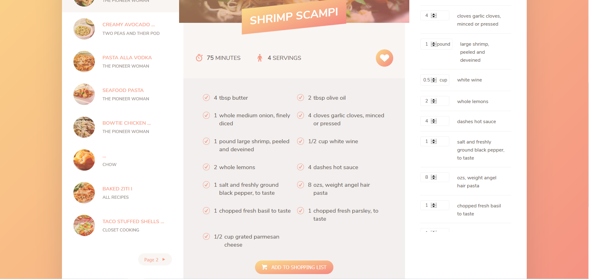

## Food Recipes Application

**Required to install npm packages**
````
npm install
````

External API: [https://forkify-api.herokuapp.com/](https://forkify-api.herokuapp.com/)

**Features:**
- Use of Webpack and Babel
- External api consumption via AXIOS
- MVC design pattern
- DOM manipulation
- LocaStorage

**Screenshot - 1**


**Screenshot - 2**
